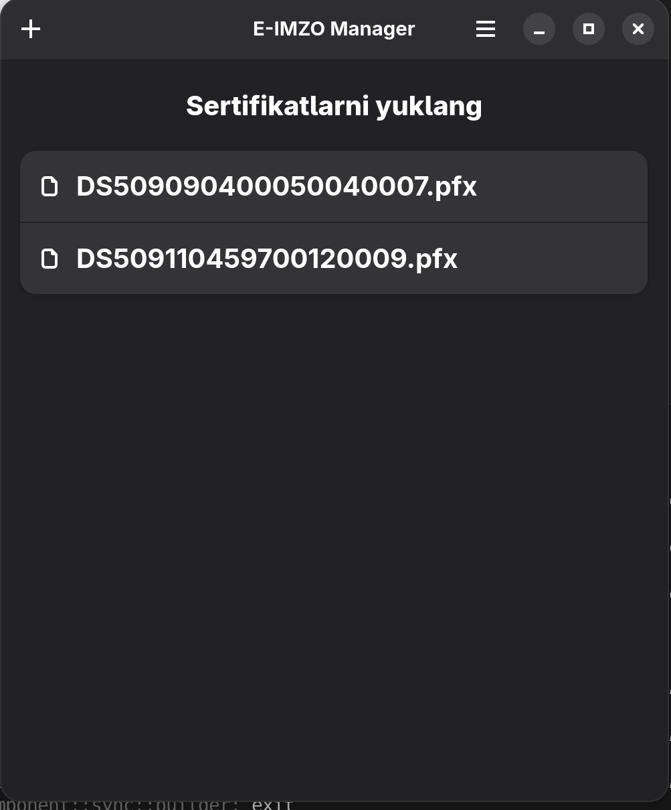

<div align="center">
  <h1>E-IMZO-Manager</h1>
  <h3><a href="https://e-imzo.soliq.uz/">E-IMZO</a> for uzbek state web key signing.</h3>


  
</div>

## Installation
| Platform   | Command                                 |
|------------|-----------------------------------------|
| Coming soon to Flathub    | <a href="https://flathub.org/apps/details/uz.xinux.EIMZOManager"></a> |

## Development
```
# do not run it inside nix-shell
nix run github:xinux-org/e-imzo

export GTK_DEBUG=interactive

meson setup build
meson compile -C build
./build/src/E-IMZO-Manager

# generate translation words from /po/POTFILES.in
xgettext --directory=.. --files-from=POTFILES.in --from-code=UTF-8 -kgettext -o messages.pot
```

## Deploy
To deploy the app, head to [Flatpak.md](Flatpak.md)


## License

This project is licensed under the CC-BY-4.0 license due to stricted use of [Soliq.uz](https://soliq.uz)'es policy - see the [LICENSE](LICENSE) file for details.

<p align="center">
    
</p>
